# Calculator App

We're going to be making a calculator app. Since we've been having issues with Android Studio and Zoom, all the instructions are compiled here (with photos) and you'll get to go through the project by yourself or with another person. 

Here's a screenshot of the final app:
<p align=center>
    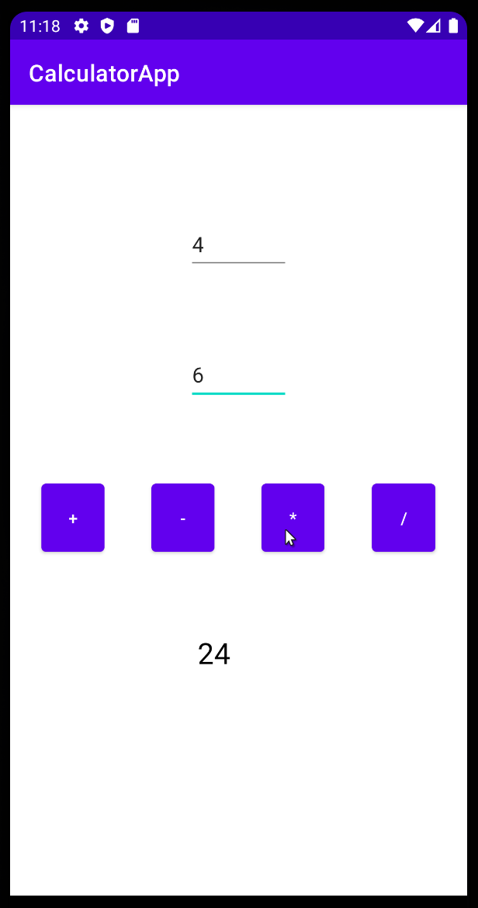
</p>

## 1. Create a New Project!

Open android studio, and create a new project. Use an **empty activity** and make sure the language is set to Java:

<p align=center>
    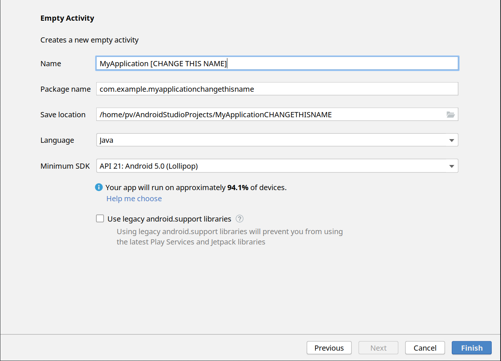
</p>

After you click "Finish", Android Studio will generate your project. It may take some time. There will be a screen that looks like the one below (you may need to click the "Project" tab on the left side): 

<p align=center>
    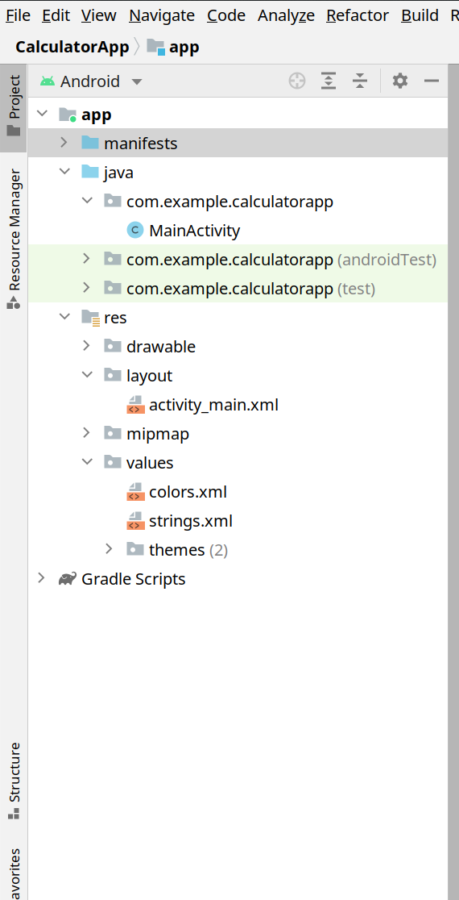
</p>

## 2. Create the User Interface!
Under `app->res->layout`, open `activity_main.xml`. You should see two screens that say "Hello World!" - if you don't, press "Design" on the left side:

<p align=center>
    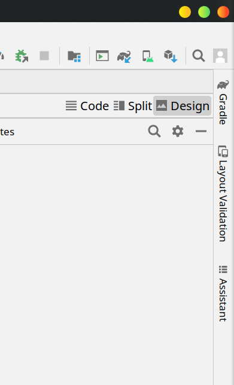
</p>

### Make the interface

Delete the "Hello World!" and drag-and-drop:
- Two EditTexts, one for each of the numbers for input
- Four Buttons. Make sure there is 1 button each for + (addition), - (subtraction), * (multiplication), and / (division).
- One TextView, for the result.

You can put them wherever you like, at whatever size you like, and whatever color you like. The size and location are set in `Attributes->Declared Attributes` or `Attributes->Layout`. Colors can be set under `Attributes->All Attributes->Background or Background Tint`.

You can drag and drop the buttons, but try to constrain your buttons and TextViews using the menu on the left:

<p align=center>
    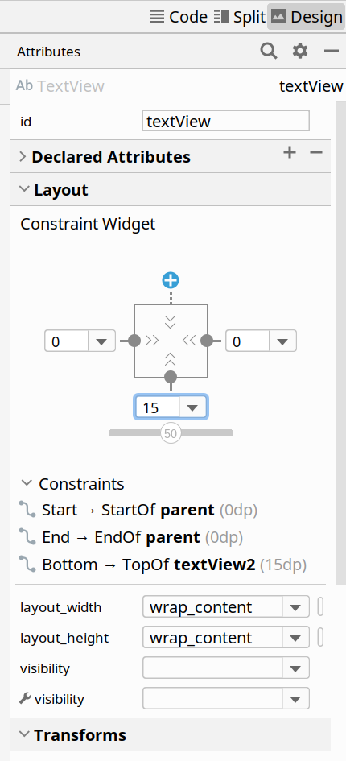
</p>

To change the text on your Button, scroll down in the Attributes window (where Layout is) until you see "Common Attributes". Look for "text". 

For the hint text in the TextViews, use Attributes->All Attributes->Hint:

<p align=center>
    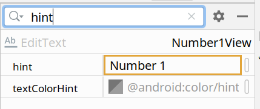
</p>

(You can use the search button too!)

<p align=center>
    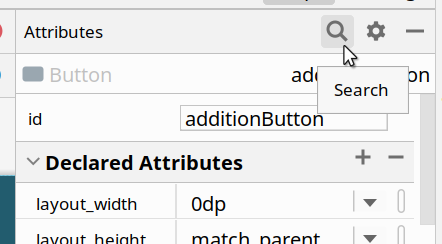
</p>

Optional: To get your buttons aligned properly, consider using a LinearLayout (under Palette->Layouts->Linear Layout). 

### IDs

**IMPORTANT:** You can set ids for each of your items using the Attributes panel. Make sure your button ids and textView ids are things that make sense and represent what the button is doing! For example, my addition button is named additionButton:

<p align=center>
    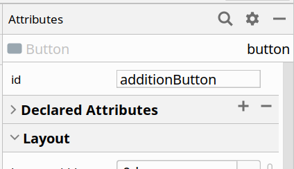
</p>

Try to make your IDs without spaces,underscores, hyphens, or any punctuation.
(if you see a message about renaming things, just press "Refactor")

### Set String variables

Since we need to be able to change the text inside the TextView, we have to use some string variables. 

Open `app->res->values->strings.xml`. 

Add a string variable for the result first:
```
    <string name="calculator_result">Result</string>
```
This creates a string named `calculator result` with value `Result`. In Java, we would have done this:
```
String calculator_result="Result";
```

Then, set the TextView's value to that string variable. Back in `activity_main.xml`, select the result's TextView and under Attributes->Common Attributes, set the text as the string's variable:

<p align=center>
    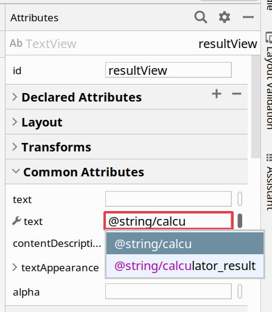
</p>

Your user interface should show the word "Result" where the TextView is:

<p align=center>
    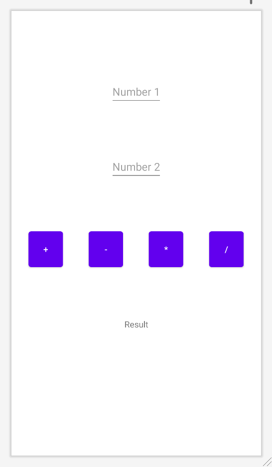
</p>

(this is my UI; I didn't change any of the colors or fonts! Yours will look different.)

## 3. Make all the buttons work!

Now, we write the Java Code. Find `app->Java->com.example.[YourAppName]->MainActivity`. 

Replace all the code in MainActivity.java with this [MainActivity Template](template/MainActivity.java).

There are many TODO statements. Start from the top, and work your way down. You can read through each of the lines or skip through and fill in only the TODO lines, your choice. There are examples in the code as well.

**To set a button's listener**: go back to `activity_main.xml` and find the button you want to set. In its Attributes menu, search for `onClick`. 
If your code compiles correctly, you should see your function in the dropdown menu:

<p align=center>
    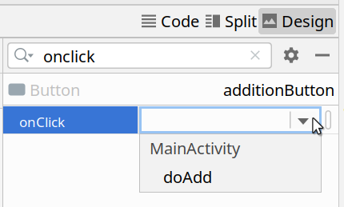
</p>

**Warning**: The division button's listener is not as easy! You can't use `int`s for division. What data type can you use?


## 4. Run your app! 
(You will probably want to do this step after leaving the Zoom call).

If you have an Android phone, use [this tutorial](https://developer.android.com/codelabs/basic-android-kotlin-training-run-on-mobile-device#0) to install your app onto your phone. 

If you don't, you can still run your app! 
1. Find `Tools->AVD Manager`. 
1. Click `Create Virtual Device`.
1. Pick a device. I picked `Pixel 3a`. Press `Next`.
1. There might be a button on the right-side menu that asks you to install HAXM. If it's there, click it. 
1. On the left-side menu, next to `R`, click `Download`. The download will take a while.
1. After the download completes, press `Next`.
1. Make sure the Startup Orientation says `Portrait`, and click `Finish`.
1. Use [these instructions](https://developer.android.com/studio/run/emulator#runningapp) to run your app. The `Run` button is hard to find - it's on the bottom of the screen! 

## 5. Stretch Goals
Some more things you can do:
- Make your app handle more than just ints! Can you convert it to doubles?
- Can you add a button to do exponent? Modulo?
- Make some error handling! in getNumbers, can you add some code to set `firstNumber` to 0 if the its EditText was empty, and `secondNumber` to 0 if the second EditText was empty?

(Based on the [Geeks4Geeks tutorial](https://www.geeksforgeeks.org/how-to-build-a-simple-calculator-app-using-android-studio/))
