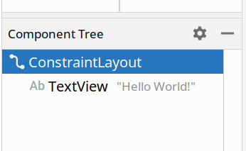
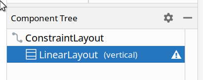

# Color Changer

We're going to be making a color-changer! 

Here are some screenshots of the final app:

    
    

## 1. Create a new project! 

You should have practice with this by now. Use an **empty activity** and make sure the language is set to Java.

## 2. Create the User Interface!
Navigate to `activity_main.xml`. Make sure the `Design` interface is selected:

    

### Create the Interface!

1. Remove all existing layouts. You can do this by finding the **component tree** on the bottom left side of the editor, selecting each of the items that are there (if any), and pressing the `delete` button on your keyboard. 
      

1. Add a **RelativeLayout** (you will need to search for this item). This is the element whose background you will be changing, so make sure to set the `id` to something sensible.

1. Add a **Vertical LinearLayout** inside the RelativeLayout. This LinearLayout aligns all the elements inside in a vertical fashion, so you won't have to do any other constraints. To double check if the LinearLayout is inside the RelativeLayout, you can look at the component tree - they should look nested instead of even with one another:
      

1. Add **four TextViews and three SeekBars** inside the LinearLayout. You can rearrange their order using the component tree. Make sure the id for each of the SeekBars is something that makes sense (for example, `redSeekBar`). Feel free to change the font color, text size, margins, padding etc. however you'd like. 

1. Set the `max` for each of the SeekBars to 255. This will make it easier to set colors. 

1. Set the `progress` for each of the SeekBars to 255. This will make the screen start out as white. 

## 3. Make the ScrollBars work! 
Now, we write the Java Code. Find `app->Java->com.example.[YourAppName]->MainActivity`. 

`com.example.[YourAppName]` is your app's **package name**. This will be important for the java code.

Replace all the code in MainActivity.java with this [MainActivity Template](template/MainActivity.java).

There are many TODO statements. Start from the top, and work your way down. You can read through each of the lines or skip through and fill in only the TODO lines, your choice. There are examples in the code as well.

## 4. Run your app! 
(You will probably want to do this step after leaving the Zoom call).

If you already have an emulator or can run apps on your phone, ignore the below steps. Simply run your app like you ran the calculator app last week.

If you have an Android phone, use [this tutorial](https://developer.android.com/codelabs/basic-android-kotlin-training-run-on-mobile-device#0) to install your app onto your phone. 

If you don't, you can still run your app! 
1. Find `Tools->AVD Manager`. 
1. Click `Create Virtual Device`.
1. Pick a device. I picked `Pixel 3a`. Press `Next`.
1. There might be a button on the right-side menu that asks you to install HAXM. If it's there, click it. 
1. On the left-side menu, next to `R`, click `Download`. The download will take a while.
1. After the download completes, press `Next`.
1. Make sure the Startup Orientation says `Portrait`, and click `Finish`.
1. Use [these instructions](https://developer.android.com/studio/run/emulator#runningapp) to run your app. The `Run` button is hard to find - it's on the bottom of the screen! 

## 5. Stretch Goals
Some more things you can do:
- Can you make the text white when the screen is dark? Can you make the SeekBars white when the screen is dark? 
- Show the progress of the SeekBar! Check out [this tutorial](https://examples.javacodegeeks.com/android/core/widget/seekbar/android-seekbar-example/) for some details. This will require the technique we did last week with the `Result` TextView. 

